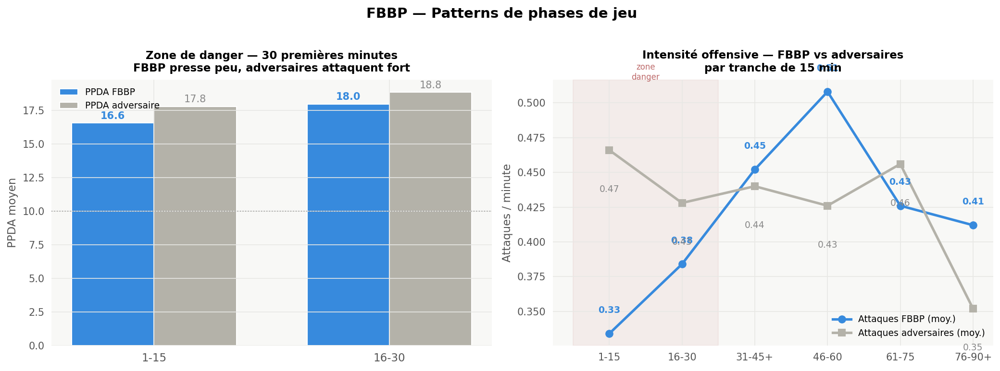
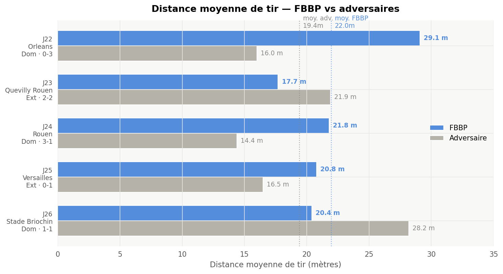

# ⚽ Analyse de performance — FBBP (National)

[](https://projet-fbbp.streamlit.app)

> ▶️ **[Explorer les tableaux de bord en ligne ↗](https://projet-fbbp.streamlit.app)** — directement dans le navigateur, sans rien installer.

Projet personnel d'**analyse de la performance football** à partir de **données réelles Wyscout** d'un club de **National** (Football Bourg-en-Bresse Péronnas 01), sur 5 matchs de la saison 2025/2026.

L'objectif : transformer de la donnée de match brute en **tableaux de bord exploitables par un staff** — lecture tactique, intensité du pressing, qualité des occasions, profils individuels — pour appuyer la préparation des matchs et le suivi de performance.

> 🔒 **Données anonymisées.** Les données joueurs proviennent de Wyscout (produit sous licence) et m'ont été transmises via un contact au club. Pour ce dépôt public, **tous les noms de joueurs et d'entraîneurs ont été remplacés par des identifiants** (`Player_01`, `Coach_01`…). Les noms d'équipes et scores (information publique) sont conservés. Aucune donnée brute non anonymisée n'est publiée.

---

## 🧰 Stack

`Python` · `pandas` · `numpy` · `Plotly` · `Streamlit` · `Matplotlib` · `Jupyter`

## 📂 Structure

```
data/         7 jeux de données CSV (format Wyscout) — voir data/readme.md
dashboards/   Application Streamlit multipage (analyse match / équipe / phases / joueur / heatmap)
notebooks/    Analyses exploratoires (Jupyter)
outputs/      Visualisations générées (PNG)
```

### Les données (5 matchs · National 2025/2026)
| Fichier | Granularité | Contenu |
|---|---|---|
| `01_matches_summary` | 1 ligne / match | Score, xG, possession, tirs, formations, PPDA global |
| `02_teams_stats` | équipe × mi-temps | Passes, duels, pressing (PPDA), récupérations |
| `03_matches_phases` | tranches de 15 min | Évolution possession / intensité / formation |
| `04_matches_events` | 1 ligne / événement | Buts, cartons, remplacements (minute précise) |
| `05_matches_shots` | 1 ligne / tir | Type, résultat, **xG**, **PsxG**, zone |
| `06_goalkeepers` | gardien × match | Arrêts, sorties, jeu au pied |
| `07_players_stats` | joueur × match | Passes, dribbles, duels, tirs, **xG / xA** |

Clé de jointure commune : `match_id` (ex. `FBBP_ORL_20260220`).

## 📊 Tableaux de bord (Streamlit)

- **Analyse match** — vue d'ensemble d'une rencontre (stats clés, momentum)
- **Analyse équipe** — tendances collectives sur les 5 matchs
- **Phases de jeu** — lecture par tranches de 15 min (zones de domination / ruptures)
- **Analyse joueur** — profilage individuel (anonymisé)
- **Heatmap équipe** — répartition de l'activité

## 📓 Notebooks (rendus directement sur GitHub)

- [chap1.ipynb](notebooks/chap1.ipynb) · [chap2.ipynb](notebooks/chap2.ipynb) — analyses exploratoires
- [player_deep_dive.ipynb](notebooks/player_deep_dive.ipynb) — focus sur un profil joueur

## 🔍 Exemples d'analyses

**Patterns de phases de jeu** — FBBP presse peu en début de match alors que les adversaires attaquent fort (PPDA & intensité offensive par tranche de 15 min) :



**Distance moyenne de tir** — FBBP tire de plus loin que ses adversaires sur la majorité des matchs (indicateur de qualité/position des occasions) :



## ▶️ Lancer le projet

```bash
pip install -r requirements.txt
streamlit run dashboards/app.py
```

---

*Projet réalisé dans le cadre de ma spécialisation en data appliquée au football (alternance recherchée — Data Analyst / Football Analytics).*
